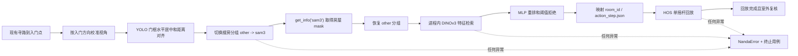

# 2026-07-20 工作总结

## 一、今日目标

今天的核心目标是将南大最新 PUBG 搜房 demo 接入 `auto_game`，并使最终运行链路满足以下要求：

1. 使用现有入门点、入门方向和 YOLO 门框完成门前对齐。
2. SAM3 仅在房型匹配时按需加载，不进入搜房常态感知。
3. 直接在 `auto_game` 进程内执行 DINOv3 + MLP 房型配准。
4. 将南大 scrcpy 回放迁移到现有 HOS 单指触控，只回放摇杆动作。
5. 不保留房型匹配 HTTP 服务。
6. 南大搜房启用后使用独占模式；出现问题立即报错，不回退原搜房方案。
7. 原搜房代码完整保留，关闭南大配置后仍可恢复使用。

## 二、最终运行架构



最终责任边界：

- `auto_game` 负责寻路到入门点、方向对齐、YOLO 门框位置校准。
- `sam3_tiny` 只负责房屋立面分割，不再负责门的对齐。
- DINOv3 + MLP 负责将当前房屋映射为南大房型 ID。
- 南大 `action_step.json` 负责房屋遍历路径。
- HOS 只复现南大 DSL 中的摇杆 `do_move`，不尝试复刻多指视角操作。

## 三、南大搜房接入

### 3.1 接入协议和状态机

新增南大搜房策略接口，拆分为三个可独立实现的部分：

- `NandaEntryPosePreparer`：门前位姿标准化。
- `NandaRoomMatcher`：SAM3 分割结果到房型的映射。
- `NandaReplayExecutor`：回放执行。

主要文件：

- [`nanda_house_search_strategy.py`](../aw/autogame/customs_examples/Auto_PUBG_ALL/resource/control/nanda_house_search_strategy.py)
- [`nanda_latest_house_search.py`](../aw/autogame/customs_examples/Auto_PUBG_ALL/resource/control/nanda_latest_house_search.py)
- [`house_search_manager.py`](../aw/autogame/customs_examples/Auto_PUBG_ALL/resource/control/house_search_manager.py)

### 3.2 门前对齐

门前对齐最终不使用 SAM3，而是：

1. 人物距离入门点 `<= 2.5` 时，按入门点记录的方向调整人物视角。
2. 入门方向代表门面的垂直方向，因此对准后视角与门水平。
3. 使用已有 YOLO 门框检测结果，继续调整人物横向位置、门框居中程度和占屏面积。
4. 位姿连续稳定达标后才允许进入 SAM3 房屋分割。

### 3.3 SAM3 按需分组

搜房阶段已导出两个实际运行分组：

- `other`：除 SAM3 外的搜房区域和特殊区域。
- `sam3`：只包含 `sam3_tiny` special area。

进入搜房阶段时默认分组为 `other`。只在房型匹配前切换到 `sam3`，在当前帧同步执行感知并通过 `get_info("sam3")` 取得结果，随后立即恢复 `other`。

主要文件：

- [`stage_group_config.py`](../aw/autogame/customs_examples/Auto_PUBG_ALL/resource/stage_group_config.py)
- [`GameSceneHandler.py`](../aw/autogame/tools/GameSceneHandler.py)
- [`GameFrameWorker.py`](../aw/autogame/tools/GameFrameWorker.py)

### 3.4 DINOv3 + MLP 房型配准

已将南大最新 demo 中的房型匹配主链路接入当前项目：

1. 从 `sam3_tiny` 的轮廓结果重建房屋 mask 和房屋立面裁剪图。
2. 使用 DINOv3 ViT-L/16 做 masked-patch pooling，生成彩色/灰度特征。
3. 从房型库中召回候选模板，按房型展开候选。
4. 使用 `rgb_mlp_struct_v7.pkl` 做 MLP 重排。
5. 由于当前方案不再额外调用 SAM3 做门窗结构分割，保留南大 MLP 输入维度，门窗结构向量用零向量表达。
6. 保留南大无强结构时的 DINO 严格拒绝阈值，防止弱匹配误回放。
7. 匹配通过后返回 `room_id` 和该房型的 `action_step.json`。

核心实现：

- [`nanda_room_matcher_runtime.py`](../aw/autogame/customs_examples/Auto_PUBG_ALL/resource/control/nanda_room_matcher_runtime.py)

### 3.5 移除 HTTP 房型匹配服务

中间版本曾通过独立匹配服务执行 DINOv3 + MLP。最终按当前工程运行方式改为完全进程内执行：

- 删除 `nanda_room_matcher_service.py`。
- 删除 `matcher_url`、`127.0.0.1:7789`、HTTP 探活、NPZ 传输和超时配置。
- 不需要启动额外进程。
- DINOv3、MLP 和房型索引在第一次实际匹配时惰性加载，后续复用。

注意：HOScrcpy 日志中的 `127.0.0.1:<动态端口>` 是 HOS 抓流所需的本地 gRPC 转发端口，与已删除的房型匹配 HTTP 无关。

### 3.6 HOS 单摇杆回放

南大 demo 原生使用 Android scrcpy 多指控制。当前华为 HOS 通道不完整支持南大的多指语义，因此采用以下边界：

- 仅解析和执行 `do_move` 摇杆动作。
- 如回放 DSL 中出现正在激活的非摇杆动作，直接拒绝执行并报错。
- 使用当前 HOS 连续触控接口执行摇杆按下、移动和抬起。
- 保留回放时间戳和相同时间戳的覆盖语义。

### 3.7 改为南大独占模式

最终生产策略已设置 `exclusive=True`。

搜房阶段第一帧会先预检：

- Python 运行依赖。
- DINOv3 配置和真实权重文件。
- MLP 权重。
- 房型库 `rooms/` 目录。

以下情况不再回退原搜房策略：

- 预检失败。
- 门前位姿无法收敛。
- SAM3 无分割结果。
- DINOv3/MLP 未找到可信房型。
- 房型索引、权重或回放文件读取异常。
- 回放执行异常。
- 回放报告完成，但人物仍未确认位于室外。

失败时会：

1. 写入 `[NandaError]`。
2. 标记 `failure_code=nanda_house_search_failed`。
3. 记录 `preflight / pose / match / replay / verify` 失败阶段。
4. 记录房屋 ID、房型 ID 和回放路径等已有上下文。
5. 终止当前用例。

原搜房逻辑未删除。当 `nanda_house_search.enabled=false` 时，系统仍可使用原搜房流程。

## 四、权重与房型库

### 4.1 `auto_game` 默认路径

DINOv3 权重：

```text
aw/autogame/customs_examples/Auto_PUBG_ALL/resource/weights/
nanda_room_matcher/dinov3_vitl16/model.safetensors
```

MLP 权重：

```text
aw/autogame/customs_examples/Auto_PUBG_ALL/resource/weights/
nanda_room_matcher/rgb_mlp_struct_v7.pkl
```

房型库：

```text
aw/autogame/customs_examples/Auto_PUBG_ALL/resource/
nanda_room_library/rooms/<room_id>/
```

也可使用以下环境变量覆盖：

- `AUTOGAME_NANDA_DINO_MODEL_DIR`
- `AUTOGAME_NANDA_MLP_MODEL_PATH`
- `AUTOGAME_NANDA_ROOM_LIBRARY`
- `AUTOGAME_NANDA_DEVICE`

### 4.2 南大最新 demo 中的来源路径

DINOv3 目标目录：

```text
/Users/liuxinkun/Downloads/projects/游戏自动化/pubg_test-main/
control_proxy/src/gametest_proxy/pubg_room_explore/
img_similarity/dinov3_vitl16/
```

MLP：

```text
/Users/liuxinkun/Downloads/projects/游戏自动化/pubg_test-main/
control_proxy/src/gametest_proxy/pubg_room_explore/
models/rgb_mlp_struct_v7.pkl
```

房型库：

```text
/Users/liuxinkun/Downloads/projects/游戏自动化/pubg_test-main/
control_proxy/src/gametest_proxy/pubg_room_explore/room_library/
```

当前下载的南大 ZIP 中：

- `model.safetensors` 只有 135 字节，是 Git LFS 指针。
- 指针声明真实 DINOv3 权重大小为 `1,212,559,808` 字节。
- `rgb_mlp_struct_v7.pkl` 是真实文件，大小为 `37,400,183` 字节。
- 房型库中当前共有 43 个房型目录和 43 个 `action_step.json`。

### 4.3 环境依赖

房型匹配依赖必须安装到实际运行 `auto_game` 的同一 Python 环境，不再使用独立服务环境。

主要依赖：

- Python 3.10+，推荐 3.11/3.12。
- NumPy 2.x。
- scikit-learn 1.7.2。
- PyTorch 2.8。
- Transformers 5.x。
- safetensors。
- FAISS CPU。

安装文件：

- [`requirements_nanda_room_matcher.txt`](../requirements_nanda_room_matcher.txt)
- [`requirements_310.txt`](../requirements_310.txt)

状态说明：

- 服务器侧模型已放入（用户确认）。
- 本地 macOS 工作区中仍只有 DINOv3 配置文件，没有真实 `model.safetensors`、MLP 权重和完整房型库。
- 本地 Python 环境缺少 `transformers` 和 `safetensors`，因此本地无法进行真实 DINOv3 推理验收。
- 服务器还需通过预检日志确认权重、房型库和依赖实际可用。

## 五、日志与故障上报

南大链路已补充操作人员可直接阅读的 `frame_log`：

- `[NandaSearch]`：管线预检、门前接管、完成复核。
- `[NandaPose]`：入门方向、门框中心偏差、面积比、稳定帧。
- `[NandaMatch]`：SAM3 分组切换、分割结果、DINO/MLP 评分、阈值拒绝、房型和回放步数。
- `[NandaReplay]`：回放输入、摇杆事件和执行完成。
- `[NandaError]`：独占模式的终止原因。

失败信号会带有：

```text
failure_code=nanda_house_search_failed
phase=preflight|pose|match|replay|verify
status=<NandaSearchStatus>
reason=<具体错误>
```

## 六、功能测试和启动器调整

除南大搜房外，今天还完成了功能测试运行策略调整。

### 6.1 截图模式遵循配置

启动器不再根据功耗/功能测试 profile 强制改写抓流模式，而是直接读取 [`config.json`](../aw/autogame/config/config.json) 中的 `screen_mode`。

当前配置：

```json
"screen_mode": "2"
```

即使用 HOScrcpy 抓流。

### 6.2 游戏进程保留/关闭策略

启动器新增统一的游戏进程策略按钮：

- `关闭进程`：红色，当前默认状态。
- `保留进程`：绿色。

该策略现已统一适用于功耗测试和功能测试，并通过：

```text
AUTOGAME_PRESERVE_GAME_PROCESS=0|1
```

传入用例进程。

影响边界：

- 测试启动前的应用清理。
- 手动停止后的应用清理。
- 自动结束后的应用清理。
- 断流恢复失败或断流自动停止时的应用清理。
- PUBG 完整流程用例和标准模板用例的 `cleanup_apps` 行为。

当前功耗测试和功能测试均默认为关闭游戏进程。

## 七、运行日志观察

今天的一段服务器运行日志显示：

1. 人物仍在距离入门点 `13.60` 的靠近阶段，还没有到达南大接管条件。
2. `wait=7481` 是按距离计算的约 7.48 秒摇杆保持时间，不是异常参数。
3. 靠近入口期间 HOScrcpy 出现 `End of TCP stream`，并进入 `attempt=1/3` 的 gRPC 重连。
4. 当前目标设备仍为 `USB Connected`；日志中的另一台 `USB Offline` 设备不是当前抓流目标。
5. 该段日志结束于端口清理阶段，没有包含最终流恢复结果。
6. 该次断流与 SAM3、DINOv3、MLP 或房型回放无关，因为南大链路尚未开始。

## 八、验证结果

今日完成的主要验证：

- Python 语法编译检查通过。
- 南大接入相关 `compileall` 通过。
- `git diff --check` 通过。
- 进程内匹配版本相关测试：19 个通过。
- 南大独占策略最终版本相关测试：23 个通过。
- 已验证生产构建的南大策略为 `exclusive=True`。
- 已验证 `NO_MATCH`、预检失败和回放完成但仍在室内时会标记失败并终止用例。

局限：由于真实 DINOv3 权重和完整推理依赖位于服务器，本地尚未完成真实 DINOv3 + MLP + HOS 真机端到端回放验收。

## 九、今日提交记录

| 提交 | 时间 | 内容 |
| --- | --- | --- |
| `ff4b1e5` | 09:41 | 新增南大房型回放策略接口 |
| `b939311` | 11:07 | 接入南大最新房型回放流程 |
| `4a66752` | 11:35 | 改为消费搜房阶段的 SAM3 结果 |
| `cf9d78e` | 14:04 | 更新搜房/SAM3 标注导出配置 |
| `2755033` | 14:16 | 继续更新标注导出配置 |
| `d6b1da0` | 14:39 | SAM3 改为只在南大匹配时加载 |
| `385a173` | 15:06 | 导出搜房 `sam3/other` 分组 |
| `0ab8c16` | 15:09 | 搜房阶段默认感知分组改为 `other` |
| `b292705` | 16:00 | 接入南大 DINOv3 + MLP 房型匹配运行时 |
| `801cbbb` | 16:07 | 启动器遵循已配置的截图模式 |
| `18fbeff` | 16:55 | 房型匹配改为进程内执行并删除 HTTP |
| `fb36d03` | 19:32 | 更新功能测试游戏进程策略 |
| `3447d54` | 19:47 | 保持游戏进程策略按钮可选 |
| `461a2ac` | 19:52 | 为关闭/保留进程状态增加颜色区分 |
| `43762ef` | 19:55 | 功能测试默认改为关闭游戏进程 |
| `9630b06` | 20:04 | 将进程策略统一应用于所有测试 profile |
| `8f04778` | 20:39 | 南大搜房改为独占策略并失败立即上报 |

上述提交均已进入 `20260715` 分支并同步到 `origin/20260715`。

## 十、下一步建议

1. 在服务器上启动功能测试，先确认出现南大独占预检通过日志。
2. 确认服务器的 DINOv3、MLP 和房型库路径均与默认路径一致，或已正确设置环境变量。
3. 验证日志中按顺序出现 `other -> sam3 -> other`，确保 SAM3 没有常态推理。
4. 记录首次 DINOv3/MLP 加载时间和后续复用时的匹配耗时。
5. 选择一个已在南大房型库中的房屋，完成首次端到端验收：门前对齐、SAM3 分割、房型命中、摇杆回放、室外复核。
6. 如失败，直接根据 `[NandaError]` 中的 `phase` 定位，不再混入原搜房逻辑。
