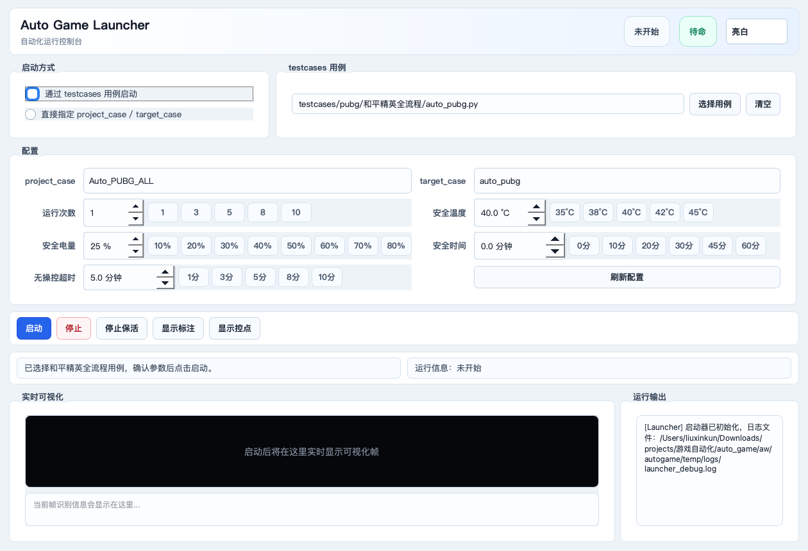
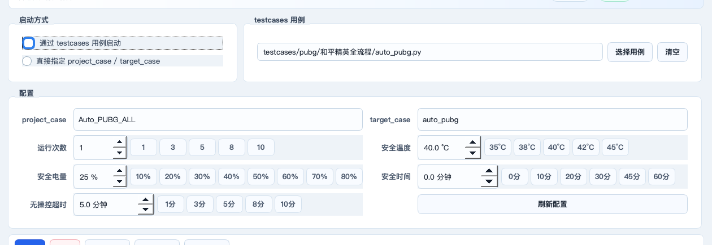
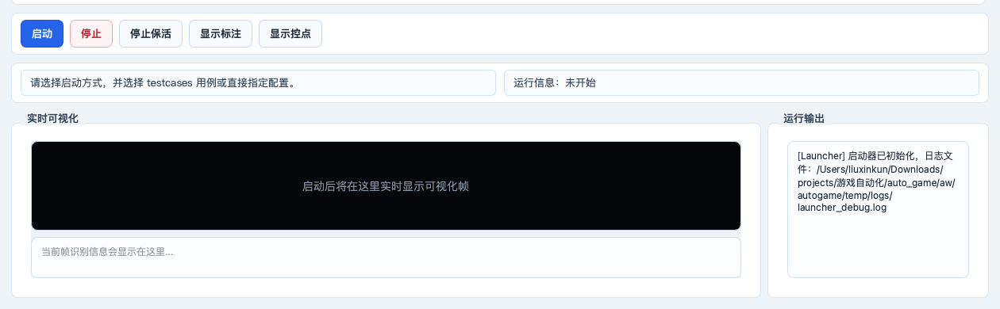

## 运行和平精英自动化

下面这部分默认你已经完成了环境搭建，例如 Python 环境、依赖包、`hdc`、`xdevice`、手机连接等都已经准备好。本节只讲一件事：怎么把和平精英自动化真正跑起来。

整体流程可以先记成 3 步：

1. 从 CodeHub 下载项目代码并解压。
2. 手机安装并登录好和平精英。
3. 打开 `launcher.py`，选择和平精英用例，设置参数后点击启动。

### 1. 从 CodeHub 下载项目代码

先在 CodeHub 上找到这个自动化项目，然后下载代码。

常见做法是：

1. 打开 CodeHub 项目页面。
2. 点击下载代码，通常是下载 ZIP 压缩包。
3. 把 ZIP 解压到本地电脑。
4. 进入解压后的项目根目录，也就是能看到 `launcher.py`、`main.py`、`README.md` 的那一层目录。

如果你解压后看到的是下面这种结构，说明位置是对的：

```text
auto_game/
├── launcher.py
├── main.py
├── README.md
├── testcases/
└── aw/
```

注意：不要随便移动 `testcases/`、`aw/`、`launcher.py` 这些目录和文件。自动化运行时会按固定目录去找资源和脚本，目录改乱后很容易出现“找不到用例”或“找不到资源”的问题。

### 2. 手机先准备好和平精英

在启动自动化前，手机上要先完成这些事情：

- 已安装和平精英。
- 已经成功登录账号。
- 第一次进入游戏时的权限弹窗、公告弹窗、实名提示、资源更新等都尽量先手动处理完。
- 手机已经通过数据线连接电脑，并且电脑能识别到设备。
- 手机电量足够，最好保持充电状态。
- 屏幕不要锁屏，游戏运行过程中不要手动切到其他应用。

这里有一个很重要的小建议：和平精英账号尽量使用新号。

原因很简单：新号更容易匹配到低强度局，遇到真人玩家的概率相对低一些，自动化流程会更稳定。如果使用老号、高等级号或经常打排位的账号，自动化过程中更容易碰到真人干扰，比如被攻击、被堵路、被提前淘汰，导致测试结果不稳定。

### 3. 启动 launcher

进入项目根目录后，运行下面的命令：

```bash
python launcher.py
```

如果你的电脑里有多个 Python 环境，要使用已经安装好项目依赖的那个 Python。启动成功后，会看到类似下面的窗口：



这个窗口可以理解成“自动化运行控制台”。左上角选择启动方式，中间设置用例和参数，下面可以看到实时画面和运行日志。

### 4. 选择启动方式

launcher 里有两种启动方式：

- `通过 testcases 用例启动`
- `直接指定 project_case / target_case`

新手建议选择 `通过 testcases 用例启动`。

这个模式会走完整流程：启动性能工具、选择和平精英、开始测试、等待游戏横屏稳定、启动自动化、抓取日志、结束后归档结果。也就是说，它更适合真正跑一轮完整的和平精英自动化。

选择方式如下：

1. 勾选 `通过 testcases 用例启动`。
2. 点击 `选择用例`。
3. 选择这个文件：

```text
testcases/pubg/和平精英全流程/auto_pubg.py
```

选中后，launcher 会自动解析出：

```text
project_case = Auto_PUBG_ALL
target_case = auto_pubg
```

如果你只是调试自动化逻辑，并且已经手动把游戏打开到了目标画面，也可以选择 `直接指定 project_case / target_case`。不过这种方式不会帮你走完整 testcase 流程，新手不建议一开始就用它。

### 5. 设置 launcher 参数

参数区如下图所示：



这些参数不用一开始就全理解，第一次跑可以先按推荐值设置。

| 参数 | 第一次运行推荐值 | 作用 |
| --- | --- | --- |
| `project_case` | `Auto_PUBG_ALL` | 标注资源工程名。它会对应到 `aw/autogame/customs_examples/Auto_PUBG_ALL/`。 |
| `target_case` | `auto_pubg` | 自动化逻辑脚本名。它会对应到 `aw/autogame/customs_game_examples/Auto_PUBG_ALL/auto_pubg.py`。 |
| 运行次数 | `1` | 跑几轮自动化。第一次先跑 1 次，确认能跑通后再改成 3、5、10。 |
| 安全温度 | `40.0 °C` | 手机温度高于这个值时，launcher 会先等待降温，不会立刻启动下一轮。 |
| 安全电量 | `25 %` | 手机电量低于这个值时，launcher 会等待充电，避免低电量跑测试。 |
| 安全时间 | `0.0 分钟` | 单轮最长允许运行多久。`0` 表示不限制总时长。想防止单轮跑太久，可以设成 30、45 或 60 分钟。 |
| 无操控超时 | `5.0 分钟` | 如果自动化长时间没有有效操作，会保存当前画面，方便排查卡在哪一步。 |

简单来说，第一次建议这样填：

```text
启动方式：通过 testcases 用例启动
testcases 用例：testcases/pubg/和平精英全流程/auto_pubg.py
project_case：Auto_PUBG_ALL
target_case：auto_pubg
运行次数：1
安全温度：40.0 °C
安全电量：25 %
安全时间：0.0 分钟
无操控超时：5.0 分钟
```

如果 `project_case` 或 `target_case` 没显示出来，可以点击 `刷新配置`。如果刷新后还是没有，通常说明目录结构不对，或者项目代码没有解压完整。

### 6. 点击启动

参数确认后，点击左下方的 `启动` 按钮。

启动后 launcher 会先做安全检查：

- 手机温度是否低于安全温度。
- 手机电量是否高于安全电量。
- 当前是否还有上一轮残留的游戏或性能工具进程。

安全检查通过后，它会开始运行和平精英 testcase。正常情况下，你会看到运行输出不断刷新，实时可视化区域也会开始显示当前帧画面。



运行过程中主要看两个地方：

- `实时可视化`：显示自动化当前看到的游戏画面。
- `运行输出`：显示启动、识别、点击、日志采集、异常提醒等信息。

如果想看自动化识别到的标注框，可以点击 `显示标注`。如果想看点击点位，可以点击 `显示控点`。这两个按钮只影响 launcher 预览，不会改变手机里的实际游戏画面。

### 7. 运行结束后去哪里看结果

每轮运行结束后，launcher 会把本轮产物归档到：

```text
aw/autogame/temp/
```

常见结果包括：

- 运行日志。
- 实时帧图。
- 异常截图。
- 设备日志。
- 分析结果。
- 按轮次保存的归档目录，例如 `game_年月日时分秒_第N次用例/`。

如果只是想确认有没有跑起来，优先看 launcher 界面的 `运行输出`。如果要排查具体卡在哪一步，再去 `aw/autogame/temp/` 下面找对应轮次的日志和截图。

### 8. 停止和保活怎么用

运行过程中可以点 `停止`。

这里要特别注意 `停止保活` 这个按钮：

- 不开启 `停止保活` 时，点击 `停止` 会直接停止当前自动化子进程，并取消后续轮次。
- 开启 `停止保活` 后，点击 `停止` 只会取消后续轮次，当前正在跑的子进程会继续运行，直到它自己结束。

如果你只是发现参数填错了，想立刻停掉重来，通常不要开启 `停止保活`，直接点 `停止` 即可。

如果你想让当前这一轮自然跑完，但不想继续跑下一轮，可以先开启 `停止保活`，再点 `停止`。

### 9. 第一次运行前检查清单

点击 `启动` 前，可以按这个清单快速检查一遍：

- 项目代码已经从 CodeHub 下载并完整解压。
- 当前命令行已经进入项目根目录。
- 手机已连接电脑，并且 `hdc list targets` 能看到设备。
- 手机里已经安装和平精英。
- 和平精英账号已经登录成功。
- 游戏里的首次弹窗、公告、权限提示尽量都已经手动处理完。
- 账号尽量使用新号。
- launcher 中选择的是 `testcases/pubg/和平精英全流程/auto_pubg.py`。
- `project_case` 是 `Auto_PUBG_ALL`。
- `target_case` 是 `auto_pubg`。
- 第一次运行时 `运行次数` 先设为 `1`。

### 10. 常见问题

#### 10.1 launcher 打开了，但点启动后提示找不到 testcase

先确认用例路径是不是：

```text
testcases/pubg/和平精英全流程/auto_pubg.py
```

如果路径不对，重新点击 `选择用例`。如果找不到这个文件，说明项目代码可能没下载完整，或者解压后目录被改过。

#### 10.2 `project_case` 或 `target_case` 是空的

先点击 `刷新配置`。

如果还是空，检查这两个文件是否存在：

```text
aw/autogame/customs_examples/Auto_PUBG_ALL/info.py
aw/autogame/customs_game_examples/Auto_PUBG_ALL/auto_pubg.py
```

这两个文件分别对应标注资源和自动化逻辑，缺任何一个都不能正常运行。

#### 10.3 一直显示温度或电量读取失败

通常是电脑没有正确识别手机，或者 `hdc` 不可用。

可以先在命令行执行：

```bash
hdc list targets
```

如果没有设备返回，先检查数据线、USB 调试授权、`hdc` 环境变量和手机连接状态。

#### 10.4 自动化卡在登录、公告或弹窗

和平精英第一次启动时经常会有公告、权限、资源更新、活动弹窗。建议先手动打开游戏，把这些弹窗处理掉，再重新跑 launcher。

#### 10.5 经常被真人干扰

优先换新号测试。新号更容易进入低强度局，自动化流程更稳定。老号或高活跃账号更容易遇到真人，对自动化跑图、搜房、开车都会有影响。

#### 10.6 运行中长时间没有动作

先看 launcher 的 `运行输出`，再看 `aw/autogame/temp/` 下是否有异常截图或无操控截图。

如果是加载慢，可以把 `无操控超时` 从 5 分钟调到 8 或 10 分钟。如果确实是自动化卡住了，就保留截图和日志，方便后续定位问题。
