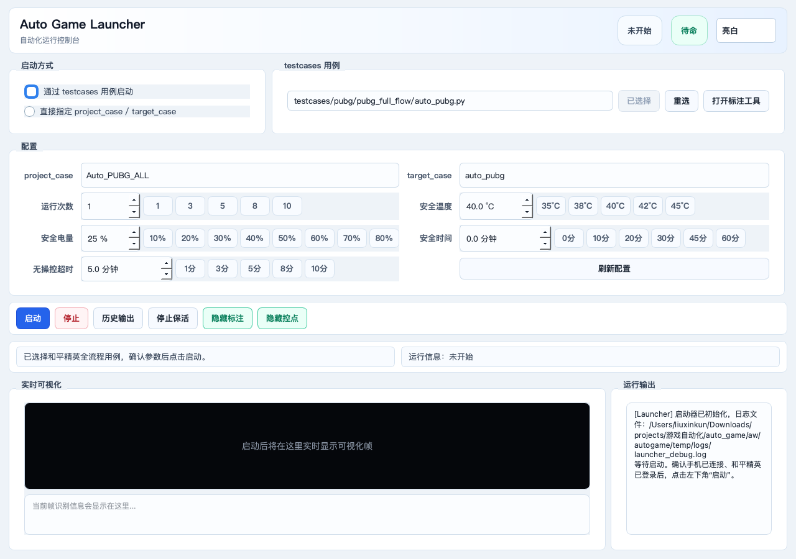
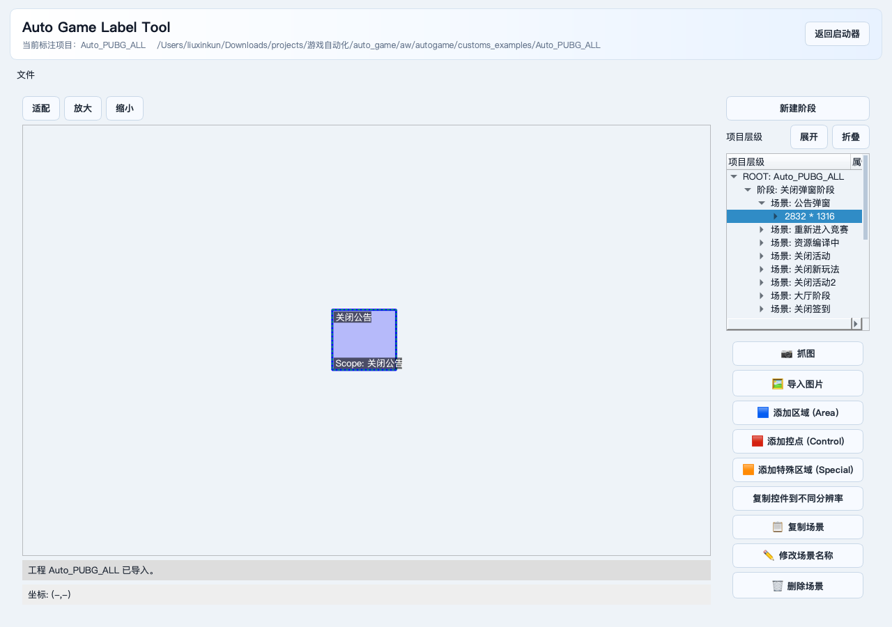
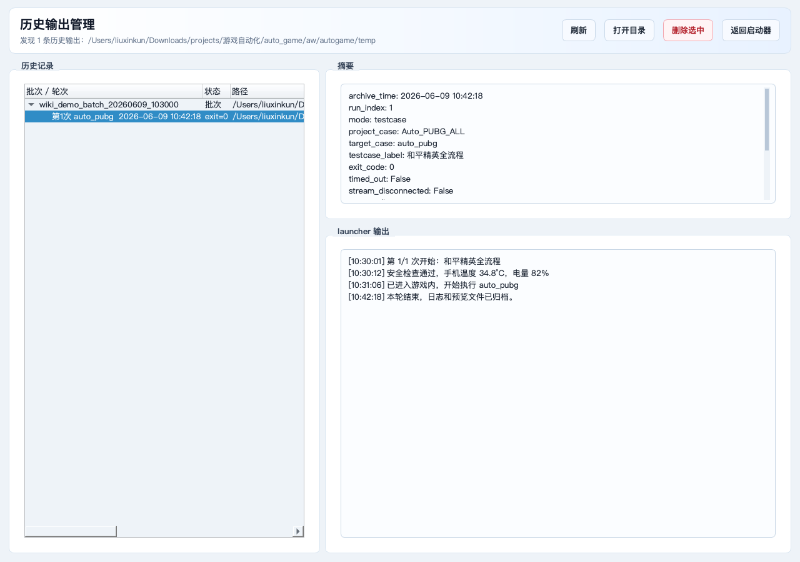

## 和平精英自动化软件使用说明
软件启动器里主要有 3 个常用页面：

- 主启动页面：选择用例、设置参数、启动和平精英自动化。
- 标注工具页面：查看或调整识别区域、点击位置、特殊识别区域。
- 历史输出页面：查看每轮运行后的日志、截图和归档结果。

整体流程可以先记成 5 步：

1. 解压软件包，并找到启动器 `.exe`。
2. 手机安装好和平精英，并提前登录成功。
3. 按评测要求手动完成手机、SP 工具、后台应用等预置条件。
4. 进入和平精英，手动确认画质、帧率等设置。
5. 在启动器窗口中选择和平精英用例，设置参数后点击启动。

### 1. 解压软件包并找到 exe

拿到打包好的软件压缩包后，先把它解压到本地电脑。解压完成后，进入解压出来的文件夹，找到启动器 `.exe` 文件。

### 2. 手机先准备好和平精英

启动自动化前，手机上要先完成这些事情：

- 已安装和平精英。
- 已经成功登录账号。
- 第一次进入游戏时的权限弹窗、公告弹窗、实名提示、资源更新等，尽量先手动处理完。
- 手机已经通过数据线连接电脑，并且电脑能识别到设备。
- 手机电量足够，最好保持充电状态。
- 屏幕不要锁屏，游戏运行过程中不要手动切到其他应用。

这里有一个很重要的小建议：和平精英账号尽量使用新号。

原因很简单：新号更容易匹配到低强度局，遇到真人玩家的概率相对低一些，自动化流程会更稳定。如果使用老号、高等级号或经常打排位的账号，自动化过程中更容易碰到真人干扰，比如被攻击、被堵路、被提前淘汰，导致测试结果不稳定。

### 3. 评测模式运行前手动预置

如果是做“和平精英经典海岛活动地图评测模式”，不要直接点启动。启动前需要先把手机和 SP 工具调整到评测状态。

先按下面清单手动确认：

| 项目 | 要求 |
| --- | --- |
| 网络 | 手机连接 Wi-Fi，网络情况良好。 |
| 室温 | 确认室温约 `26°C`，并记录环境温度。 |
| 手机温度 | 正式开始前先让手机置凉，建议 `Shell_frame` 低于 `30°C`。 |
| SP 工具 | 安装最新版本 SP 工具，打开 SP 工具，并打开悬浮窗口设置。 |
| SP 悬浮窗 | SP 工具不要点开折线图窗口，只保留最小的悬浮球。 |
| 手机亮度 | 亮度如果软件已经支持自动设置，可以交给软件；如果没有自动设置成功，再手动调整到评测要求的 `300nit`。 |
| 媒体音量 | 手机媒体音量调到满格。 |
| 电量 | 手机电量保持 `80%` 以上。 |
| 开关状态 | 开启蓝牙、位置信息、Huawei Share；关闭超级省电、NFC。 |
| 后台应用 | 保持 8 个应用在后台：微信、支付宝、抖音、卓易通、高德地图、B站、小红书、淘宝。 |
| 后台账号 | 上面 8 个后台应用需要登录账号，并保持登录状态。 |
| 其他限制 | 不开语音，不开小窗，不连接蓝牙设备。 |

这一步的目的，是让每次评测的环境尽量一致。温度、亮度、后台负载、网络和 SP 工具状态不一致，都会影响最终数据。

### 4. 手动确认游戏画面和地图设置

进入正式自动化前，需要先通过 SP 工具打开和平精英，并登录进入游戏主界面。然后手动进入：

```text
设置 -> 画面设置
```

按照本次评测要跑的档位选择画面品质和帧数：

| 评测档位 | 画面品质 | 帧数设置 |
| --- | --- | --- |
| `60帧 + HDR` | `HDR` | `60帧` |
| `90帧 + HDR` | `HDR` | `90帧` |
| `90帧 + 流畅` | `流畅` | `90帧` |
| `120帧` | `流畅` | `120帧` |

不管跑哪个档位，下面这些通用设置都要确认：

| 设置项 | 要求 |
| --- | --- |
| 画面风格 | `经典` |
| 抗锯齿 | `开` |
| 阴影 | `开` |
| 游戏内屏幕亮度 | `100%` |
| 异形屏 UI 适配 | 保持默认 |
| 流畅自适应 | `关` |
| 大厅镜面反射效果开关 | `关` |

设置完成后，一定要点击右下角 `确认修改`。如果没有点确认，游戏可能不会真正应用这些设置。

正式评测节奏是：

- `10分钟搜房 + 10分钟开车 + 10分钟跑图` 为一轮。
- 测试 2 轮，总测试时间约 `60分钟`。
- 如果角色死亡，先暂停 SP，重新开一局。
- 新一局跳伞落地后再开启 SP，并继续上一局没完成的阶段。
- 总测试时间达到 60 分钟后，长按 SP 悬浮球保存数据。

### 5. 打开启动器

双击软件包里的启动器 `.exe` 后，会打开自动化启动器窗口。

启动成功后，会看到下面这个主窗口：



这个窗口可以理解成“自动化运行控制台”。新手主要用它完成 4 件事：

- 选择和平精英全流程用例。
- 设置运行次数、温度、电量、超时等参数。
- 点击 `启动` 跑自动化。
- 查看实时画面、运行日志和历史输出。

### 6. 主窗口页面怎么看

主窗口从上到下可以分成几块：

| 区域 | 小白理解 | 主要操作 |
| --- | --- | --- |
| 顶部状态栏 | 看当前是否在运行 | 关注 `未开始`、`待命`、`运行中` 等状态 |
| 启动方式 | 决定怎么启动自动化 | 新手选择 `通过 testcases 用例启动` |
| testcases 用例 | 选择要跑哪条完整流程 | 选择和平精英全流程用例 |
| 配置 | 设置项目、脚本和安全参数 | 第一次按推荐值设置 |
| 操作按钮 | 启动、停止、看历史、打开标注工具 | 点击 `启动` 开始运行 |
| 实时可视化 | 看自动化当前识别到的画面 | 观察是否卡住、是否有识别框 |
| 运行输出 | 看运行日志 | 报错时优先看这里 |

第一次使用时，不需要每个区域都研究透。只要按下面步骤操作即可。

### 7. 选择启动方式和用例

启动器里有两种启动方式：

- `通过 testcases 用例启动`
- `直接指定 project_case / target_case`

新手建议选择 `通过 testcases 用例启动`。

这个模式会读取软件内置的和平精英全流程配置，更适合正式评测。注意：SP 工具状态、游戏画面设置、地图选择、角色落地后开启 SP 记录这些前置动作，仍然要按前面章节手动完成。

选择方式如下：

1. 勾选 `通过 testcases 用例启动`。
2. 点击 `选择用例`。
3. 选择软件包内置的和平精英全流程用例。

如果窗口里显示类似 `testcases/pubg/pubg_full_flow/auto_pubg.py` 的英文路径，这是正常的。它表示你选中了软件内置的“和平精英全流程”用例，不需要额外准备文件。

选中后，软件会自动解析出：

```text
project_case = Auto_PUBG_ALL
target_case = auto_pubg
```

选错用例时，点击 `重选`，重新选择正确用例即可。

如果你只是调试自动化逻辑，并且已经手动把游戏打开到了目标画面，也可以选择 `直接指定 project_case / target_case`。不过这种方式不会帮你走完整 testcase 流程，新手不建议一开始就用它。

### 8. 设置运行参数

第一次运行可以先按推荐值设置：

| 参数 | 第一次运行推荐值 | 作用 |
| --- | --- | --- |
| `project_case` | `Auto_PUBG_ALL` | 软件内置的和平精英标注资源工程名。 |
| `target_case` | `auto_pubg` | 软件内置的和平精英自动化流程名。 |
| 运行次数 | 调试先用 `1`，正式评测用 `2` | 跑几轮自动化。第一次先跑 1 次，确认能跑通后，正式评测按 2 轮执行。 |
| 安全温度 | `40.0 °C` | 手机温度高于这个值时，软件会先等待降温，不会立刻启动下一轮。 |
| 安全电量 | `25 %` | 手机电量低于这个值时，软件会等待充电，避免低电量跑测试。 |
| 安全时间 | `0.0 分钟` | 单轮最长允许运行多久。`0` 表示不限制总时长。想防止单轮跑太久，可以设成 30、45 或 60 分钟。 |
| 无操控超时 | `5.0 分钟` | 如果自动化长时间没有有效操作，会保存当前画面，方便排查卡在哪一步。 |

简单来说，第一次建议这样填：

```text
启动方式：通过 testcases 用例启动
testcases 用例：和平精英全流程
project_case：Auto_PUBG_ALL
target_case：auto_pubg
运行次数：1
安全温度：40.0 °C
安全电量：25 %
安全时间：0.0 分钟
无操控超时：5.0 分钟
```

如果 `project_case` 或 `target_case` 没显示出来，可以点击 `刷新配置`。如果刷新后还是没有，通常说明软件包没有完整解压，或者软件包里的文件被移动过。

### 9. 点击启动

参数确认后，再检查一次：手机已按评测要求预置，游戏画面设置已经点过 `确认修改`，地图已经选择 `经典海岛活动地图`，角色已落地并开启 SP 记录。确认无误后，点击左下方的 `启动` 按钮。

启动后软件会先做安全检查：

- 手机温度是否低于安全温度。
- 手机电量是否高于安全电量。
- 当前是否还有上一轮残留的游戏或性能工具进程。

安全检查通过后，它会开始运行和平精英 testcase。正常情况下，你会看到运行输出不断刷新，实时可视化区域也会开始显示当前帧画面。

运行过程中主要看两个地方：

- `实时可视化`：显示自动化当前看到的游戏画面。
- `运行输出`：显示启动、识别、点击、日志采集、异常提醒等信息。

如果想看自动化识别到的标注框，可以点击 `显示标注`。如果想看点击点位，可以点击 `显示控点`。这两个按钮只影响启动器预览，不会改变手机里的实际游戏画面。

### 10. 标注工具怎么用

打包后的启动器里已经集成了标注工具，不需要再单独打开别的软件。标注工具的作用，就是把游戏画面里的“识别对象”和“操作位置”标出来，让自动化知道要看哪里、点哪里、读哪里。

简单说：

- 自动化识别错了，就来这里调整识别区域。
- 自动化点击歪了，就来这里调整控点位置。
- 游戏界面新增了按钮、弹窗或场景，就来这里补充标注。
- 想检查当前和平精英自动化用了哪些识别资源，也可以来这里看。

#### 10.1 打开标注工具页面

操作方式：

1. 先在主窗口选择和平精英全流程用例。
2. 确认 `project_case` 显示为 `Auto_PUBG_ALL`。
3. 点击 `打开标注工具`。

打开后会切到下面这个页面：



这个页面可以这样理解：

| 区域 | 小白理解 | 主要用途 |
| --- | --- | --- |
| 顶部标题栏 | 当前打开的是标注工具页 | 看当前标注项目是不是 `Auto_PUBG_ALL` |
| 中间画布 | 显示场景截图和标注框 | 查看或修改 Area、Control、Special Area |
| 右侧项目树 | 标注资源的目录结构 | 找阶段、场景、标注项 |
| 右侧按钮区 | 对标注进行操作 | 抓图、导入图片、添加区域、添加控点等 |
| `返回启动器` | 回到主运行窗口 | 标注改完后回到启动器 |

#### 10.2 先理解四个核心概念

标注工具里的内容是从大到小一层一层组织的：

| 概念 | 小白理解 | 例子 |
| --- | --- | --- |
| `Project` 项目 | 一个游戏或一套自动化资源 | `Auto_PUBG_ALL` |
| `Stage` 阶段 | 自动化流程里的一个大步骤 | 登录阶段、开始游戏阶段、搜房阶段 |
| `Scene` 场景 | 某个阶段下面的一张具体画面 | 主界面、公告弹窗、游戏内画面 |
| `Item` 标注项 | 场景里真正要识别或操作的对象 | 按钮特征、点击控点、小地图区域 |

可以这样理解：

```text
项目 Project
└── 阶段 Stage
    └── 场景 Scene
        ├── 区域 Area
        ├── 控点 Control
        └── 特殊区域 Special Area
```

右侧项目树就是用来找这些内容的。你要改哪个按钮、哪个画面，通常先在项目树里找到对应阶段和场景，再选中具体标注项。

#### 10.3 三种标注项怎么选

标注项主要分 3 类：`Area`、`Control`、`Special Area`。


| 类型 | 颜色 | 小白理解 | 常见用途 |
| --- | --- | --- | --- |
| `Area` | 蓝色框 | 给自动化看的“识别特征” | 判断按钮、图标、提示文字是否出现 |
| `Control` | 红色框 | 给自动化点的“操作位置” | 点击按钮、拖动摇杆、滑动视角 |
| `Special Area` | 橙色框 | 需要特殊算法处理的区域 | 小地图、方向、OCR、模型识别区域 |

`Area` 要尽量框稳定、有辨识度的小块内容。不要框太大，也不要把会变化的倒计时、动画、血量数字一起框进去。

`Control` 要尽量框在按钮中心附近。按钮很大时，不需要把整个按钮都框住，框一个稳定的中心区域即可。

`Special Area` 用来处理更复杂的信息，比如小地图位置、人物朝向、OCR 文字、模型识别区域。普通按钮识别和点击一般不用它。

#### 10.4 新手修改标注的推荐流程

如果你只是修一个已经存在的和平精英自动化资源，建议按下面这个顺序操作：

1. 在主窗口选择和平精英全流程用例。
2. 点击 `打开标注工具`。
3. 在右侧项目树里找到要修改的阶段和场景。
4. 选中已有标注项，先看它是不是框错位置。
5. 如果是识别问题，优先调整蓝色 `Area`。
6. 如果是点击问题，优先调整红色 `Control`。
7. 如果当前画面已经变化，可以点击 `抓图` 或 `导入图片` 更新场景图片。
8. 修改完成后保存或导出标注资源。
9. 点击 `返回启动器` 回到主窗口。
10. 回到主窗口后点击 `刷新配置`，再重新运行验证。

#### 10.5 新增标注时怎么做

如果遇到新的按钮、弹窗或游戏画面，需要新增标注，可以按这个顺序：

1. 先在右侧项目树里选中对应场景。
2. 点击 `添加区域 (Area)`，在画布上框住稳定特征。
3. 如果后续需要点击，再点击 `添加控点 (Control)`，在画布上框住点击位置。
4. 如果是小地图、方向、文字识别等复杂信息，再考虑 `添加特殊区域 (Special)`。
5. 给新标注起一个容易看懂的名字，例如 `开始按钮特征`、`开始按钮`、`小地图区域`。
6. 保存或导出后，回到启动器重新运行验证。

新手命名建议：

- 名字尽量写清楚用途，不要只写 `button1`、`area2`。
- 用来识别的 Area 可以叫 `xxx特征`。
- 用来点击的 Control 可以直接叫 `xxx按钮`。
- 同一类内容尽量保持命名风格一致，后面排查问题会轻松很多。

#### 10.6 标注修改前后怎么判断有没有效果

标注不是改完就一定正确，建议用下面的方法验证：

1. 改标注前，先记住自动化卡在哪个画面、哪个按钮或哪一步。
2. 修改并保存标注后，返回启动器。
3. 点击 `刷新配置`。
4. 运行 1 次和平精英全流程。
5. 看 `实时可视化` 里识别框是否对准。
6. 看 `运行输出` 里是否还停在同一步。
7. 如果失败，再去 `历史输出` 里打开本轮日志和截图继续排查。

常见判断方法：

- 识别不到：Area 可能框得太大、太小、内容变化太多，或者没有设置合适的搜索范围。
- 误识别：Area 可能框了太普通的背景，建议换成更独特的图标或文字。
- 点击歪：Control 可能太靠边，建议框在按钮中心附近。
- 特殊区域没结果：Special Area 可能需要对应的处理逻辑配合，不只是画框就能生效。

标注工具不用每次运行都打开。正常跑自动化时，只需要在主启动页面选择用例并点击 `启动`；只有识别、点击或场景资源需要调整时，才进入标注工具页面。

### 11. 历史输出窗口页面

每轮运行结束后，软件会把本轮产物归档到：

```text
软件目录/运行输出目录
```

打包后的启动器提供了一个 `历史输出` 页面，可以不用手动翻目录，也能先快速看每轮运行结果。

在主窗口点击 `历史输出`，会看到下面这个页面：



这个页面可以这样用：

| 区域或按钮 | 作用 |
| --- | --- |
| 左侧 `历史记录` | 按批次和轮次列出已经归档的运行结果。 |
| 右上 `摘要` | 显示本轮的时间、运行模式、`project_case`、`target_case`、退出码、是否超时等信息。 |
| 右下 `launcher 输出` | 显示本轮保存下来的启动器日志，排查失败时优先看这里。 |
| `刷新` | 重新扫描软件目录下的历史归档。 |
| `打开目录` | 打开当前选中的历史输出目录。 |
| `删除选中` | 删除选中的历史输出，清理磁盘空间。删除前要确认不要误删重要日志。 |
| `返回启动器` | 回到主运行窗口。 |

常见结果包括：

- 运行日志。
- 实时帧图。
- 异常截图。
- 设备日志。
- 分析结果。
- 预览视频。
- 按轮次保存的归档目录，例如 `game_年月日时分秒_第N次用例/`。

如果只是想确认有没有跑起来，优先看启动器界面的 `运行输出` 和 `历史输出` 页面。如果要排查具体卡在哪一步，再点击 `打开目录`，进入对应轮次的日志和截图目录。

### 12. 停止和保活怎么用

运行过程中可以点 `停止`。

这里要特别注意 `停止保活` 这个按钮：

- 不开启 `停止保活` 时，点击 `停止` 会直接停止当前自动化子进程，并取消后续轮次。
- 开启 `停止保活` 后，点击 `停止` 只会取消后续轮次，当前正在跑的子进程会继续运行，直到它自己结束。

如果你只是发现参数填错了，想立刻停掉重来，通常不要开启 `停止保活`，直接点 `停止` 即可。

如果你想让当前这一轮自然跑完，但不想继续跑下一轮，可以先开启 `停止保活`，再点 `停止`。

### 13. 第一次运行前检查清单

点击 `启动` 前，可以按这个清单快速检查一遍：

- 软件包已经完整解压。
- 启动器 `.exe` 是在解压目录里直接打开的，没有被单独拖走。
- 手机已连接电脑，并且 `hdc list targets` 能看到设备。
- 手机里已经安装和平精英。
- 和平精英账号已经登录成功。
- 游戏里的首次弹窗、公告、权限提示尽量都已经手动处理完。
- 账号尽量使用新号。
- 室温、环境温度、手机温度已确认。
- SP 工具已打开，且只保留最小悬浮球。
- 画面品质、帧数、通用画面设置已确认，并且点过 `确认修改`。
- 地图已选择 `经典海岛活动地图`。
- 角色已落地，并已开启 SP 记录。
- 启动器中选择的是和平精英全流程用例。
- `project_case` 是 `Auto_PUBG_ALL`。
- `target_case` 是 `auto_pubg`。
- 调试时 `运行次数` 先设为 `1`，正式评测时按要求设为 `2`。

### 14. 常见问题

#### 14.1 打包版启动器打不开

先确认你是在解压后的完整目录里双击启动器，而不是把启动器文件单独复制到了桌面。

如果还是打不开，再检查：

- 压缩包是否完整解压。
- 是否被杀毒软件或系统权限拦截。
- 启动器是否还在原来的软件目录里，没有被单独复制出去。
- 环境搭建文档里要求的设备工具是否已经配置好。

如果仍然打不开，可以把报错截图或启动器同目录下的日志文件发给维护人员排查。

#### 14.2 启动器打开了，但点启动后提示找不到用例

先确认你选择的是“和平精英全流程”用例。如果选错了，点击 `重选`，重新选择和平精英全流程用例。

如果选择用例时找不到内容，通常说明软件包没有完整解压，或者软件包里的文件被移动过。

#### 14.3 `project_case` 或 `target_case` 是空的

先点击 `刷新配置`。

如果还是空，通常说明软件包没有完整解压，或者软件包里的资源目录被移动过。可以重新解压软件包后再打开 `.exe`。

#### 14.4 点 `打开标注工具` 没反应或提示缺少标注资源

先确认已经选择了和平精英全流程用例，并且 `project_case` 是：

```text
Auto_PUBG_ALL
```

如果还是打不开，说明标注资源可能没有随软件包带上，或者软件包解压不完整。可以重新解压软件包后再试。

#### 14.5 Area 识别不到或经常误识别

先打开标注工具，找到对应场景里的蓝色 `Area`。

如果识别不到，常见原因是框选内容变化太大、框得太大、框到了动态数字或动画。可以把框缩小，只框最稳定、最有辨识度的图标或文字。

如果经常误识别，常见原因是框选内容太普通，比如只框了一块背景。可以换成更独特的按钮图标、固定文字或明显边缘。

改完后记得保存或导出，回到启动器点击 `刷新配置`，再运行 1 次验证。

#### 14.6 Control 点击位置不准

先打开标注工具，找到对应场景里的红色 `Control`。

按钮类控点尽量框在按钮中心附近，不要贴着按钮边缘。如果按钮很大，不需要把整个按钮都框住，框一个稳定的中心区域即可。

改完后保存或导出，回到启动器重新运行，看点击是否落在正确位置。

#### 14.7 一直显示温度或电量读取失败

通常是电脑没有正确识别手机，或者 `hdc` 不可用。

可以先在命令行执行：

```bash
hdc list targets
```

如果没有设备返回，先检查数据线、USB 调试授权、`hdc` 环境变量和手机连接状态。

#### 14.8 自动化卡在登录、公告或弹窗

和平精英第一次启动时经常会有公告、权限、资源更新、活动弹窗。建议先手动打开游戏，把这些弹窗处理掉，再重新跑启动器。

#### 14.9 经常被真人干扰

优先换新号测试。新号更容易进入低强度局，自动化流程更稳定。老号或高活跃账号更容易遇到真人，对自动化跑图、搜房、开车都会有影响。

#### 14.10 运行中长时间没有动作

先看启动器的 `运行输出`，再去 `历史输出` 页面选择本轮记录。如果已经生成归档，可以点击 `打开目录` 查看异常截图或无操控截图。

如果是加载慢，可以把 `无操控超时` 从 5 分钟调到 8 或 10 分钟。如果确实是自动化卡住了，就保留截图和日志，方便后续定位问题。

#### 14.11 画质或帧率设置没有生效

先重新进入和平精英的 `设置 -> 画面设置`，确认画面品质、帧数设置和通用设置都符合本次评测档位。

最容易漏的一步是右下角 `确认修改`。只改选项但没有点击 `确认修改`，游戏可能不会真正应用设置。

如果刚改过帧率或画质，建议回到大厅后再检查一次设置项，确认已经保持在目标档位，再开始正式评测。
