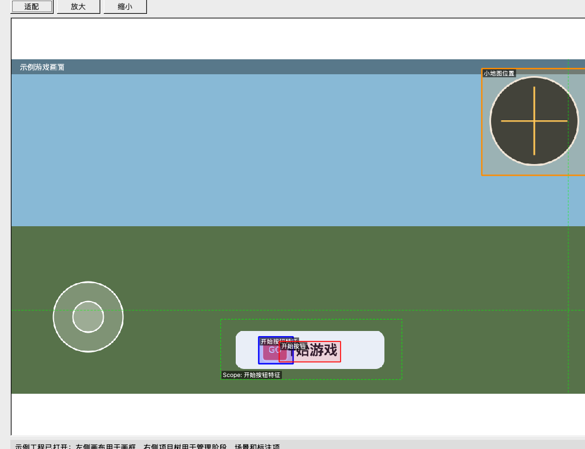
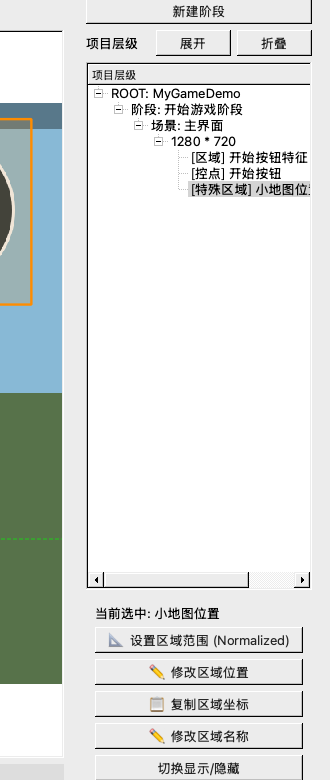
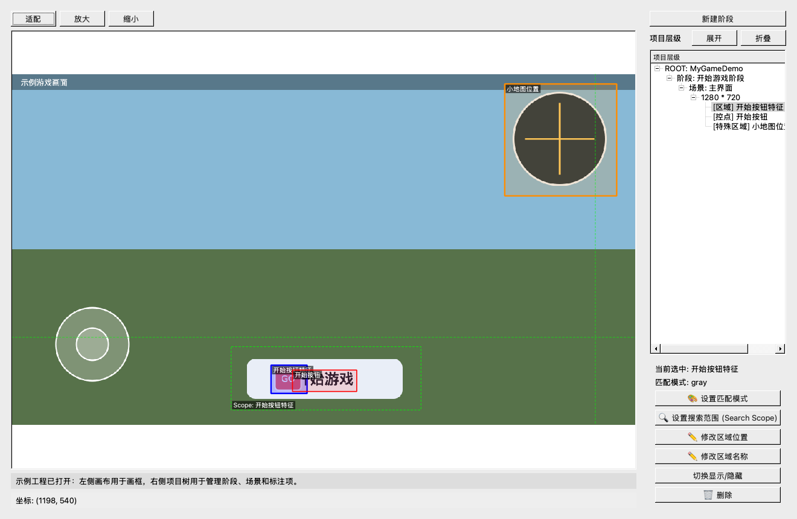
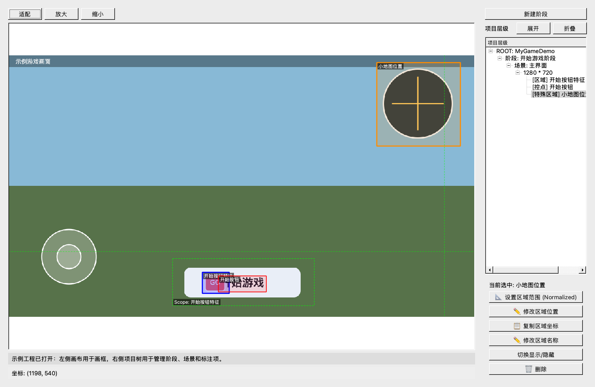

## 标注工具使用说明

这份文档面向第一次使用标注工具的新手。你不需要先理解整个自动化框架，只要按下面的步骤做，就能知道：标注工具怎么打开、界面怎么看、怎么新建项目、怎么抓图、怎么画框、最后怎么导出给自动化脚本使用。

先记住一句话：标注工具的作用，就是把游戏画面里的“识别对象”和“操作位置”标出来，让后面的自动化脚本知道要看哪里、点哪里、读哪里。

### 1. 标注工具是做什么的

游戏自动化运行时，需要回答几个问题：

- 当前画面是不是我想要的场景？
- 某个按钮、图标、提示文字有没有出现？
- 如果要点击，应该点屏幕哪个位置？
- 如果要读取小地图、方向、OCR、模型结果，应该截取哪一块画面？

标注工具就是用来提前把这些位置标好的。

标注完成后，工具会导出一份资源工程，里面包含：

- 场景截图。
- 区域模板图。
- 控点位置。
- 特殊区域位置。
- `info.py` 配置文件。
- `resource/SpecialSceneHandler.py` 特殊区域处理函数文件。

自动化运行时会读取这些导出结果，再配合脚本里的 `w.get_info(...)`、`w.click(...)` 等接口完成识别和操作。

### 2. 启动标注工具

进入项目根目录，也就是能看到 `launcher.py`、`main.py`、`aw/` 的那一层目录，然后执行：

```bash
python aw/autogame/tools/Label.py
```

启动成功后，会看到类似下面的界面：


这个界面可以简单分成 3 块：

- 左侧大区域：画布，用来显示游戏截图，也是在这里拖动鼠标画框。
- 右上区域：项目树，用来管理项目、阶段、场景和标注项。
- 右下区域：操作面板，选中不同对象时，会显示不同操作按钮。

### 3. 先理解三个核心概念

标注工具里的结构是从大到小一层一层管理的：

| 概念 | 通俗解释 | 示例 |
| --- | --- | --- |
| `Project` 项目 | 一个游戏或一个自动化资源工程 | `Auto_PUBG_ALL`、`MyGameDemo` |
| `Stage` 阶段 | 自动化流程中的大步骤 | 登录阶段、开始游戏阶段、跑图阶段、开车阶段 |
| `Scene` 场景 | 阶段下面的一张具体画面 | 主界面、弹窗、地图界面、游戏内画面 |
| `Item` 标注项 | 场景里真正要识别或操作的对象 | Area、Control、Special Area |

新手可以这样理解：

```text
项目 Project
└── 阶段 Stage
    └── 场景 Scene
        ├── 区域 Area
        ├── 控点 Control
        └── 特殊区域 Special Area
```

举个例子：如果你要让脚本在游戏主界面点击“开始游戏”，可以这样建：

```text
Project：MyGameDemo
Stage：开始游戏阶段
Scene：主界面
Area：开始按钮特征
Control：开始按钮
```

`Area` 用来判断按钮是否出现，`Control` 用来真正点击按钮。

### 4. 三种标注项怎么选

标注项主要有三类：`Area`、`Control`、`Special Area`。



从颜色上看：

- 蓝色框：`Area`
- 红色框：`Control`
- 橙色框：`Special Area`
- 绿色虚线框：`Search Scope`

#### 4.1 Area：用来判断某个特征有没有出现

`Area` 可以理解成“识别用的小截图”。导出时，工具会把你框选的区域裁剪成模板图。自动化运行时，会拿当前游戏画面和这个模板做匹配。

适合标成 `Area` 的内容：

- 按钮上的固定图标。
- 固定文字提示。
- 状态图标。
- 不容易变化的 UI 特征。
- 某个场景独有的小块画面。

新手建议：

- 框得小一点，尽量只框最稳定、最有辨识度的部分。
- 不要把大块背景一起框进去。
- 不要框会经常变化的内容，例如倒计时数字、血量条、动态动画。
- 如果这个特征只会在某个区域附近出现，要设置 `Search Scope`，这样识别更快也更稳定。

脚本里常见用法：

```python
if w.get_info("开始按钮特征"):
    w.click("开始按钮")
```

#### 4.2 Control：用来点击、滑动、长按

`Control` 可以理解成“操作点”。工具里虽然画的是一个红色矩形，但自动化运行时通常会取矩形中心点作为点击或滑动起点。

适合标成 `Control` 的内容：

- 按钮中心。
- 摇杆中心。
- 开火按钮。
- 地图按钮。
- 视角滑动区域。
- 双指缩放的起点区域。

新手建议：

- 按钮类控点尽量框在按钮中心附近。
- 不要贴着按钮边缘框，避免不同分辨率或 UI 偏移时点歪。
- 如果按钮很大，不需要把整个按钮都框住，框一个稳定的中心区域即可。

脚本里常见用法：

```python
w.click("开始按钮")
w.tap_single("摇杆", y_bias=-300, dura=300, wait=1000)
```

#### 4.3 Special Area：用来自定义图像处理

`Special Area` 用来处理更复杂的信息。它不是简单判断“有没有出现”，而是把你框选的区域裁剪出来，交给 `SpecialSceneHandler.py` 里的函数处理。

适合标成 `Special Area` 的内容：

- 小地图位置。
- 人物朝向。
- 车速或移动状态。
- 障碍物检测区域。
- OCR 文字识别区域。
- YOLO 或分类模型需要处理的区域。

导出后，工具会在下面文件里生成同名函数：

```text
aw/autogame/customs_examples/<project_case>/resource/SpecialSceneHandler.py
```

比如你标了一个特殊区域叫 `小地图位置`，导出后就会生成或保留对应处理函数。后续你需要在这个函数里补充识别逻辑。

脚本里常见用法：

```python
pos = w.get_info("小地图位置")
if pos:
    ...
```

### 5. 推荐的新手操作流程

第一次使用时，建议按这个顺序来，不要一上来就标很多东西。

#### 5.1 新建项目

点击菜单栏：

```text
文件 -> 新建项目
```

然后输入项目名，例如：

```text
MyGameDemo
```

项目名很重要，它通常会成为导出目录名。建议使用英文、数字、下划线，不要用空格或奇怪符号。

#### 5.2 新建阶段

项目建好后，右侧会出现 `新建阶段` 按钮。

点击 `新建阶段`，输入阶段名，例如：

```text
开始游戏阶段
```

阶段是自动化的大流程节点。一个完整自动化一般会有多个阶段，例如：

- 启动阶段
- 登录阶段
- 开始游戏阶段
- 跑图阶段
- 搜房阶段
- 开车阶段

新手第一次可以只建一个阶段。

#### 5.3 新建场景

选中刚创建的阶段后，右侧操作面板会出现 `添加场景`。

点击 `添加场景`，输入场景名，例如：

```text
主界面
```

场景是一张具体画面。比如“开始游戏阶段”下面，可以有“主界面”“公告弹窗”“确认弹窗”等多个场景。

#### 5.4 给场景加图片

选中场景后，右侧会出现两个常用按钮：

- `抓图`
- `导入图片`

`抓图` 会通过 `hdc` 从当前连接的手机上截取当前屏幕。使用它之前，要确保手机已连接，且下面命令能看到设备：

```bash
hdc list targets
```

`导入图片` 是从本地选择一张已经保存好的截图。如果暂时没有手机，或者只想先练习标注，可以用这种方式。

图片加载后，左侧画布会显示这张图，就可以开始画框了。

### 6. 怎么添加 Area、Control、Special Area

选中某个场景，并且场景已经有图片后，右侧会出现 3 个添加按钮：

- `添加区域 (Area)`
- `添加控点 (Control)`
- `添加特殊区域 (Special)`

也可以使用快捷键：

| 快捷键 | 作用 |
| --- | --- |
| `Ctrl + A` | 添加 Area |
| `Ctrl + C` | 添加 Control |
| `Ctrl + S` | 添加 Special Area |

添加方式都差不多：

1. 先选中当前场景。
2. 点击要添加的按钮，例如 `添加区域 (Area)`。
3. 鼠标移动到左侧画布。
4. 按住鼠标左键拖出一个矩形框。
5. 松开鼠标后，输入名称。
6. 确认后，右侧项目树里会出现这个标注项。

如果画错了，可以选中标注项，在右侧操作面板里修改位置、改名、隐藏或删除。

### 7. 项目树和操作面板怎么看

右侧项目树会显示当前工程的完整层级：



你点不同层级，右下角出现的按钮也不同。

| 选中对象 | 常见操作 |
| --- | --- |
| 阶段 | 添加场景、粘贴场景、修改阶段名称、删除阶段 |
| 场景 | 抓图、导入图片、添加 Area、添加 Control、添加 Special、复制场景、删除场景 |
| Area | 设置匹配模式、设置搜索范围、修改区域位置、修改名称、隐藏、删除 |
| Control | 修改控点位置、修改控点名称、隐藏、删除 |
| Special Area | 设置区域范围、修改区域位置、复制区域坐标、修改名称、隐藏、删除 |

也可以在画布上的标注框上点右键，打开对应的快捷菜单。

### 8. Area 的 Search Scope 和匹配模式

选中一个 `Area` 后，右侧会出现 `设置匹配模式` 和 `设置搜索范围 (Search Scope)`：



`Search Scope` 是绿色虚线框，表示“只在这块范围里找 Area 模板”。

什么时候需要设置 `Search Scope`：

- 目标按钮可能在某个局部区域内移动。
- 画面里有多个相似图标，容易误识别。
- 全屏搜索太慢。
- 模板太小，容易匹配到其他地方。

新手建议：

- 如果目标位置比较固定，可以让 `Search Scope` 稍微比目标可能出现的范围大一点。
- 不要把 `Search Scope` 设得太小，目标稍微偏一点就可能识别不到。
- 也不要无脑设成全屏，全屏搜索更慢，也更容易误判。

匹配模式一般可以先用默认的 `gray`：

| 匹配模式 | 适合场景 |
| --- | --- |
| `gray` | 默认推荐，适合大多数按钮、图标、文字特征 |
| `rgb` | 颜色特征很重要，灰度容易误判时使用 |
| `hsv` | 颜色区分明显，但亮度可能变化时可以尝试 |

### 9. Special Area 的坐标和处理函数

选中 `Special Area` 后，可以看到设置区域范围、复制区域坐标等操作：



`Special Area` 的坐标可以用画布拖框来设置，也可以用归一化坐标设置。归一化坐标就是 0 到 1 之间的小数，例如：

```text
0.800000,0.050000,0.970000,0.320000
```

它表示：

- `x1`：左上角横坐标比例
- `y1`：左上角纵坐标比例
- `x2`：右下角横坐标比例
- `y2`：右下角纵坐标比例

使用归一化坐标的好处是，不同分辨率下更容易换算位置。

不过新手一开始不用手写坐标，直接在画布上拖框即可。只有需要精确复制、跨分辨率调位置时，再用复制坐标或手动输入。

### 10. 标注命名建议

名称会被脚本直接使用，所以命名要清楚、稳定。

推荐：

```text
开始按钮特征
开始按钮
返回按钮
小地图位置
方向区域
驾驶按钮
开火按钮
```

不推荐：

```text
a
btn1
test
框1
这里
随便
```

命名时最好遵守这些规则：

- 名称能说明用途。
- 同一阶段里同类标注尽量不要重名。
- `Area` 和 `Control` 可以成对命名，例如 `开始按钮特征` 和 `开始按钮`。
- 要给脚本长期使用的名字，不要随便改。

### 11. 导出项目

标注完成后，点击菜单栏：

```text
文件 -> 导出项目
```

默认会导出到：

```text
aw/autogame/customs_examples/
```

导出后通常会得到这样的目录：

```text
aw/autogame/customs_examples/<project_case>/
├── info.py
├── scenes/
├── templates/
└── resource/
    └── SpecialSceneHandler.py
```

这些文件的作用是：

| 文件或目录 | 作用 |
| --- | --- |
| `info.py` | 核心配置，记录阶段、场景、Area、Control、Special Area |
| `scenes/` | 保存场景截图 |
| `templates/` | 保存 Area 和 Special Area 裁剪出的模板图 |
| `resource/SpecialSceneHandler.py` | 保存 Special Area 对应的处理函数 |

如果导出时提示同名目录已经存在，一般有几个选择：

- `替换原工程`：覆盖同名工程，适合你明确是在更新这个工程。
- `备份原目录`：先备份旧目录，再导出新目录，适合不确定是否要覆盖时使用。
- `修改工程名`：换一个新项目名导出。
- `关闭`：取消导出。

新手如果不确定，优先选 `备份原目录`，这样旧工程还在。

### 12. 导出后脚本怎么使用

导出完成后，自动化脚本需要知道两个名字：

```python
project_case = "MyGameDemo"
target_case = "你的脚本名"
```

`project_case` 对应标注工具导出的资源目录名。

脚本里常见使用方式：

```python
if w.get_info("开始按钮特征"):
    w.click("开始按钮")
```

再比如读取特殊区域结果：

```python
pos = w.get_info("小地图位置")
if pos:
    print(pos)
```

注意：标注工具只负责导出位置和模板，不会自动帮你写完整业务逻辑。`Special Area` 的识别逻辑也需要在 `SpecialSceneHandler.py` 里补充。

### 13. 常用快捷操作

| 操作 | 说明 |
| --- | --- |
| `适配` | 把图片缩放到适合当前画布的大小 |
| `放大` | 放大画布 |
| `缩小` | 缩小画布 |
| `Ctrl + 鼠标滚轮` | 快速缩放画布 |
| 鼠标右键点击标注框 | 打开该标注项的快捷菜单 |
| 拖动标注框 | 快速调整位置 |
| `展开` | 展开右侧项目树 |
| `折叠` | 折叠右侧项目树 |

### 14. 第一次标注建议

新手第一次不要直接做完整游戏流程，建议先做一个最小闭环：

1. 新建项目 `MyGameDemo`。
2. 新建阶段 `开始游戏阶段`。
3. 新建场景 `主界面`。
4. 导入或抓取一张主界面截图。
5. 标一个 `Area`，命名为 `开始按钮特征`。
6. 标一个 `Control`，命名为 `开始按钮`。
7. 导出项目。
8. 在脚本里用 `w.get_info("开始按钮特征")` 判断是否出现。
9. 出现后用 `w.click("开始按钮")` 点击。

这个最小流程跑通后，再慢慢增加弹窗、返回按钮、特殊区域、多个阶段。

### 15. 常见问题

#### 15.1 点击添加 Area 后没反应

先检查是否已经选中了具体的场景，并且场景里已经有图片。

如果没有选中场景，或者还没抓图/导入图片，工具不知道应该在哪张图上画框。

#### 15.2 抓图失败

通常是 `hdc` 或设备连接问题。

先在命令行执行：

```bash
hdc list targets
```

如果没有设备返回，检查数据线、USB 调试授权、`hdc` 环境变量和手机连接状态。

#### 15.3 Area 经常识别不到

常见原因：

- 框得太大，带了太多背景。
- 框到了动态内容，例如动画、倒计时、闪烁特效。
- `Search Scope` 太小，目标稍微偏一点就找不到。
- 当前游戏分辨率和标注截图差异太大。

优先尝试：

- 重新框选更稳定的小特征。
- 放大一点 `Search Scope`。
- 确认运行设备和标注截图分辨率是否一致。

#### 15.4 Area 经常误识别

常见原因：

- 框得太小，特征不够独特。
- 画面里有多个相似图标。
- `Search Scope` 太大。

优先尝试：

- 选择更有辨识度的图案。
- 缩小 `Search Scope` 到目标可能出现的区域。
- 尝试切换匹配模式，例如从 `gray` 改成 `rgb`。

#### 15.5 点击位置不准

检查 `Control` 是否标在按钮中心。

如果按钮区域很大，建议只框按钮中间稳定位置。不要贴边框，也不要框到按钮外面。

#### 15.6 Special Area 没有结果

先确认两件事：

- 是否已经导出项目。
- `resource/SpecialSceneHandler.py` 里是否有对应函数，并且函数里已经写了处理逻辑。

如果函数只是默认生成的空函数，它不会返回有效结果，需要你自己补识别代码。

### 16. 导出前检查清单

导出前可以快速检查：

- 项目名是否正确。
- 阶段名是否清楚。
- 场景是否都有图片。
- Area 是否框在稳定特征上。
- Control 是否框在按钮中心。
- Special Area 是否框住完整识别区域。
- 重要 Area 是否设置了合适的 Search Scope。
- 名称是否和脚本里要使用的名字一致。
- 不需要的测试标注是否已经删除。

### 17. 一句话总结

标注工具的使用顺序就是：

```text
新建项目 -> 新建阶段 -> 新建场景 -> 抓图或导入图片 -> 添加 Area / Control / Special Area -> 检查命名和位置 -> 导出项目
```

第一次使用时，先跑通一个按钮识别和点击的小例子，再逐步扩展到完整游戏流程，会轻松很多。
