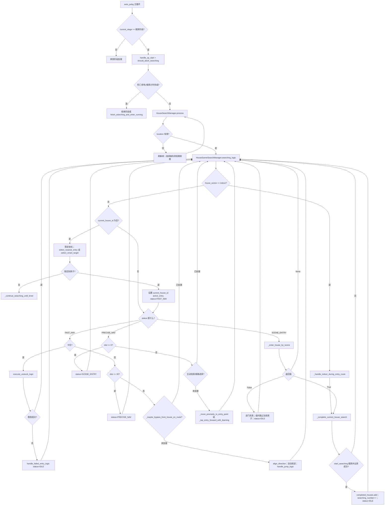

```mermaid
flowchart TD
    A["auto_pubg 主循环"] --> B{"current_stage == 搜房阶段?"}
    B -- "否" --> X["其他阶段处理"]
    B -- "是" --> C["handle_sp_start + should_abort_searching"]
    C --> D{"死亡/排名/搜房计时完成?"}
    D -- "是" --> E["结束阶段或 finish_searching_and_enter_running"]
    D -- "否" --> F["HouseSearchManager.process"]
    F --> G{"location 有效?"}
    G -- "否" --> H["刷新帧；连续缺失则轻微前推"] --> F
    G -- "是" --> I["HouseSceneSearchManager.searching_logic"]

    I --> J{"house_scene == indoor?"}
    J -- "是" --> K["_handle_indoor_during_entry_route"] --> S["_complete_current_house_search"]
    J -- "否" --> L{"current_house_id 为空?"}

    L -- "是" --> M["稳定坐标；select_nearest_entry 或 select_smart_target"]
    M --> N{"锁定到房子?"}
    N -- "否" --> O["_continue_searching_until_timer"]
    N -- "是" --> P["设置 current_house_id active_entry status=FAST_NAV"]

    L -- "否" --> Q{"status 是什么?"}
    P --> Q

    Q -- "FAST_NAV" --> R{"卡住?"}
    R -- "是" --> R1["execute_unstuck_logic"]
    R1 --> R2{"脱困成功?"}
    R2 -- "否" --> R3["handle_failed_entry_logic status=IDLE"] --> I
    R2 -- "是" --> I
    R -- "否" --> T{"dist <= 30?"}
    T -- "是" --> U["status=PRECISE_NAV"] --> I
    T -- "否" --> V{"_maybe_bypass_front_house_on_route?"}
    V -- "已处理" --> I
    V -- "未处理" --> W["align_direction；自动前进；handle_jump_logic"] --> I

    Q -- "PRECISE_NAV" --> Y{"dist <= 0?"}
    Y -- "是" --> Z["status=SCENE_ENTRY"] --> I
    Y -- "否" --> AA{"主动绕房/顺路进房?"}
    AA -- "已处理" --> I
    AA -- "未处理" --> AB["_move_precisely_to_entry_point 或 _tap_entry_forward_with_learning"] --> I

    Q -- "SCENE_ENTRY" --> AC["_enter_house_by_scene"]
    AC --> AD{"返回值"}
    AD -- "None" --> I
    AD -- "False" --> AE["进门失败；临时跳过当前房子；status=IDLE"] --> I
    AD -- "True" --> S
    S --> AF{"start_searching 搜房并出房成功?"}
    AF -- "是" --> AG["completed_houses.add；searching_number++；status=IDLE"] --> I
    AF -- "否" --> I
```